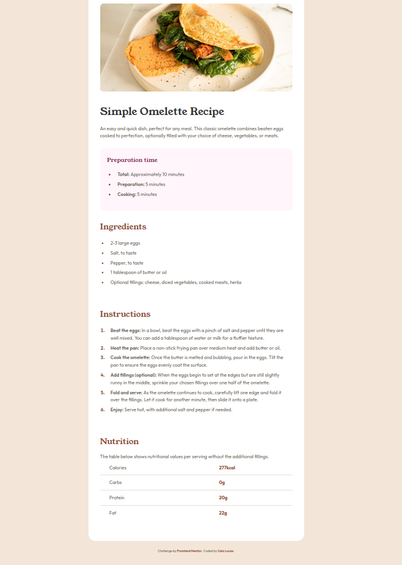

# Recipe Page

Meu primeiro desafio do Frontend Mentor - Uma página simples de receita

**Status:**
- Desktop - Concluído
- Mobile - Em desenvolvimento



## Links

- [Repositório no GitHub] (https://github.com/caiolucasprogramador/recipe-page-frontend-mentor)
- [Desafio no Frontend Mentor] (https://www.frontendmentor.io/challenges/recipe-page-KiTsR8QQKm)

## Tecnologias utilizadas

- HTML5 semântico
- CSS3 com variáveis
- Flexbox
- Fontes customizadas locais

## O que aprendi

Neste projeto, pratiquei:

- Estruturação semântica com HTML (`<article>`, `<section>`, `<table>`)
- Uso de variáveis CSS (`:root`)
- Flexbox para centralização e alinhamento
- Estilização de listas com `::marker`
- Importação de fontes locais com `@font-face`
- Box Model (margin, padding, border)
- Seletores avançados (`:first-of-type`, `:last-child`)

## Desafios enfrentados

- Entender a diferença entre `margin` e `padding`
- Aplicar Flexbox corretamente
- Estilizar marcadores de lista com cores personalizadas

## Como rodar o projeto

1. Clone o repositório:
```bash
git clone https://github.com/caiolucasprogramador/recipe-page-frontend-mentor.git
```

2. Abra o arquivo `index.html` no navegador

## Autor

**Caio Lucas**
- GitHub: [@caiolucasprogramador] (https://github.com/caiolucasprogramador)
- Frontend Mentor: [@caiolucasprogramador] (https://www.frontendmentor.io/profile/caiolucasprogramador)

---

💡 *Desafio do [Frontend Mentor] (https://www.frontendmentor.io)